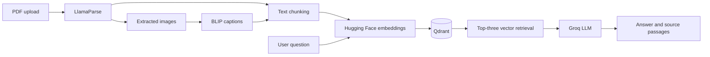

# Multimodal Enterprise RAG

PDF question answering with Chainlit, LlamaIndex, Qdrant, Groq, and Hugging Face inference.

**Live demo:** [multimodal-enterprise-rag.onrender.com](https://multimodal-enterprise-rag.onrender.com/)

## Overview

Upload a PDF, let the application parse and index its text and generated image captions, then ask questions in the chat. The application retrieves relevant passages from Qdrant and sends them to a Groq-hosted language model to generate an answer with source context.

## Features

- PDF parsing and Markdown extraction with LlamaParse.
- Text chunking with 512-token chunks and 50-token overlap.
- Normalized 384-dimensional embeddings from Hugging Face hosted inference. The web service does not load a local transformer model.
- Vector storage and similarity search with Qdrant.
- Groq-backed answer generation with retrieved passages and available source metadata.
- Image extraction and BLIP-generated captions indexed as text alongside document chunks.
- Separate CLI experiments for hybrid retrieval, Cross-Encoder reranking, and Self-RAG.

## Architecture



## Technology

| Area | Component |
| --- | --- |
| Chat interface | Chainlit |
| RAG framework | LlamaIndex |
| PDF parsing | LlamaParse |
| Embeddings | Hugging Face Inference API, `sentence-transformers/all-MiniLM-L6-v2` |
| Vector database | Qdrant |
| Answer generation | Groq OpenAI-compatible API, `openai/gpt-oss-120b` |
| Image captions | Hugging Face Inference API and BLIP |
| Deployment | Docker and Render |

## Repository Layout

```text
app/
  agents/       Relevance evaluation and Self-RAG experiment
  frontend/     Chainlit upload and chat handlers
  ingestion/    PDF parsing, chunking, image captions, embeddings
  retrieval/    Qdrant retrieval and optional reranking
  utils/        Environment-backed settings
scripts/        Ingestion, query, and Self-RAG command-line demos
data/           Local PDFs and extracted images (ignored by Git)
docker-compose.yml  Local Qdrant service
Dockerfile          Render container build and startup
pyproject.toml      Poetry dependencies and optional extras
poetry.lock         Resolved dependency versions
```

## Run Locally

### Requirements

- Python 3.11, 3.12, or 3.13
- Poetry 2.x
- Docker Desktop or another Qdrant instance
- API credentials for LlamaParse and Groq
- A Hugging Face token is recommended for inference rate limits

### Install

```bash
git clone https://github.com/somiaamari/Multimodal-Enterprise-RAG.git
cd Multimodal-Enterprise-RAG
poetry install
```

Create a `.env` file in the repository root:

```dotenv
LLAMA_PARSE_API_KEY=your_llamaparse_api_key
GROQ_API_KEY=your_groq_api_key
HF_TOKEN=your_huggingface_token

# Local Qdrant defaults
QDRANT_HOST=localhost
QDRANT_PORT=6333
QDRANT_USE_HTTPS=false
# QDRANT_API_KEY is optional for local Qdrant
```

Start Qdrant and Chainlit:

```bash
docker compose up -d qdrant
poetry run chainlit run app/frontend/chat.py --watch
```

Open [http://localhost:8000](http://localhost:8000), upload a PDF, wait for indexing, and ask questions in the chat.

## Deploy on Render

The repository Dockerfile starts Chainlit on Render's assigned `PORT`. Connect this GitHub repository to a Render Web Service using the Docker runtime. Enable auto-deploy for the branch you push to.

Configure these environment variables in Render:

| Variable | Purpose |
| --- | --- |
| `LLAMA_PARSE_API_KEY` | Parse uploaded PDFs |
| `GROQ_API_KEY` | Generate answers |
| `HF_TOKEN` | Authenticate Hugging Face inference and improve rate limits |
| `QDRANT_HOST` | Qdrant Cloud URL or hostname |
| `QDRANT_API_KEY` | Qdrant Cloud API key, if required |
| `QDRANT_USE_HTTPS` | Set to `true` for HTTPS connections |

Use an external Qdrant service for deployed data. The local Docker Compose volume is for development and is not persistent production storage.

## Retrieval Flow

1. LlamaParse converts an uploaded PDF into Markdown documents and extracts images.
2. `SentenceSplitter` creates chunks of 512 tokens with 50 tokens of overlap.
3. Hosted embedding inference converts chunks to normalized 384-dimensional vectors.
4. Qdrant stores vectors and payload metadata.
5. The chat app embeds the question and retrieves the three closest vectors.
6. The Groq LLM answers from the retrieved context; the UI displays source text and available metadata.

## Optional CLI Experiments

The live chat app uses vector retrieval without the local Cross-Encoder, keeping the Render memory footprint lower. Install the optional reranking and Self-RAG dependency locally with:

```bash
poetry install --extras reranking
```

Then run commands from the repository root:

```bash
# Ingest the first PDF in data/
poetry run python -m scripts.ingest

# Run the sample reranked query workflow
poetry run python -m scripts.query

# Run the Self-RAG demonstration
poetry run python -m scripts.self_rag_demo
```

The Self-RAG demo contains sample prompts written for a Tesla report; replace them when using another document.

## Current Scope and Limitations

- Hybrid retrieval, reranking, and Self-RAG are separate experimental paths and are not enabled in the live chat workflow.
- Images are represented by generated text captions. The app does not currently perform image-vector retrieval or visual question answering.
- Ingestion recreates the configured Qdrant collection. A new upload replaces the previous collection contents, so the live demo is intended for one active document at a time.
- Parsing, embedding, and answer generation require network access and valid provider credentials. Availability and rate limits depend on those services.

